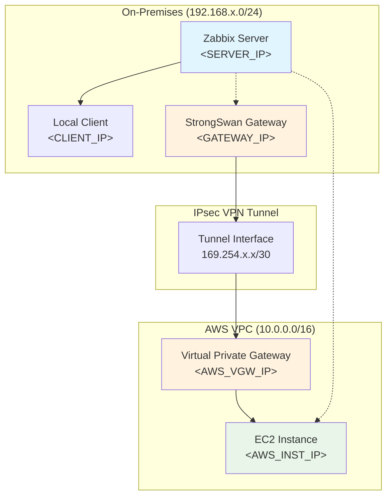

# Hybrid Cloud Monitoring with Zabbix and AWS VPN Integration

[](https://opensource.org/licenses/MIT)
[](https://www.zabbix.com/)
[](https://aws.amazon.com/)
[](https://www.strongswan.org/)

> **Enterprise-grade hybrid cloud monitoring solution** combining on-premises Zabbix infrastructure with AWS cloud resources through secure IPsec VPN tunneling.

## 🚀 Project Overview

This project implements a **comprehensive monitoring infrastructure** that bridges on-premises and cloud environments:

- 🏠 **Local Network Monitoring**: Zabbix server monitoring on-premises Linux systems
- ☁️ **AWS Cloud Integration**: Secure VPN tunnel to monitor AWS EC2 instances  
- 🔗 **Hybrid Architecture**: Unified monitoring across distributed infrastructure
- 🔒 **Enterprise Security**: IPsec encryption and proper access controls

## 🏗️ Architecture

### Network Topology



### 🔧 Component Overview

| Component | Purpose | Technology |
|-----------|---------|------------|
| **Zabbix Server** | Central monitoring system | Zabbix 6.x |
| **Local Clients** | On-premises monitored systems | Zabbix Agent |
| **VPN Gateway** | IPsec tunnel endpoint | StrongSwan on Fedora |
| **AWS VPC** | Cloud infrastructure | AWS Virtual Private Cloud |
| **EC2 Instances** | Cloud monitored resources | Zabbix Agent on EC2 |

## 📋 Prerequisites

### System Requirements

- [ ] **Linux System** (Fedora/CentOS/Ubuntu) for VPN gateway
- [ ] **Public IP address** for IPsec endpoint
- [ ] **AWS Account** with VPC and EC2 access
- [ ] **Network connectivity** between all components

### Software Dependencies

```bash
# Fedora/CentOS
sudo dnf install strongswan zabbix-agent

# Ubuntu/Debian  
sudo apt update && sudo apt install strongswan zabbix-agent

# AWS EC2 (Amazon Linux)
sudo yum install zabbix-agent
```

## 🚀 Quick Start

### Phase 1: Local Network Monitoring

1. **Configure Zabbix Agent**
   ```bash
   # Edit agent configuration
   sudo nano /etc/zabbix_agentd.conf
   
   # Key settings:
   Server=<ZABBIX_SERVER_IP>
   ServerActive=<ZABBIX_SERVER_IP>
   ListenIP=0.0.0.0
   ListenPort=10050
   
   # Start service
   sudo systemctl enable --now zabbix-agent
   ```

2. **Test Local Connectivity**
   ```bash
   zabbix_get -s <CLIENT_IP> -k agent.ping
   # Expected output: 1
   ```

### Phase 2: VPN Tunnel Setup

1. **Install StrongSwan**
   ```bash
   sudo dnf install strongswan  # Fedora/CentOS
   sudo apt install strongswan  # Ubuntu/Debian
   ```

2. **Configure VPN Tunnel**
   ```bash
   # Create VTI interface
   sudo ip link add ip_vti0 type vti key 1
   sudo ip addr add 169.254.x.x/30 dev ip_vti0
   sudo ip link set ip_vti0 up
   
   # Add routing to AWS VPC
   sudo ip route add 10.0.0.0/16 dev ip_vti0
   ```

3. **Configure StrongSwan**
   ```ini
   # /etc/strongswan/ipsec.conf
   conn aws-tunnel-1
       authby=secret
       auto=start
       left=%defaultroute
       leftid=<GATEWAY_PUBLIC_IP>
       right=<AWS_VGW_TUNNEL_IP>
       type=tunnel
       ikelifetime=8h
       keylife=1h
       ike=aes128-sha1-modp1024
       esp=aes128-sha1-modp1024
       mark=1
   ```

### Phase 3: AWS Integration

1. **Configure EC2 Security Groups**
   ```yaml
   # Allow Zabbix agent communication
   - Protocol: TCP
     Port: 10050
     Source: 192.168.x.0/24
   ```

2. **Install and Configure Agent on EC2**
   ```bash
   # Install agent
   sudo yum install zabbix-agent  # Amazon Linux
   
   # Configure
   sudo nano /etc/zabbix/zabbix_agentd.conf
   Server=<ZABBIX_SERVER_IP>
   Hostname=aws-instance-1
   
   # Start service
   sudo systemctl enable --now zabbix-agent
   ```

## 🔧 Management Commands

### VPN Management
```bash
# Start/stop VPN tunnel
sudo strongswan start
sudo strongswan stop

# Check tunnel status
sudo strongswan status

# Restart specific connection
sudo strongswan restart aws-tunnel-1

# Monitor VPN logs
sudo journalctl -u strongswan -f
```

### AWS Integration Testing
```bash
# Test VPN connectivity
ping <AWS_INSTANCE_IP>

# Check routing to AWS
ip route show | grep 10.0.0.0

# Monitor tunnel interface
watch -n 5 'ip a show ip_vti0'

# Test Zabbix agent through VPN
zabbix_get -s <AWS_INSTANCE_IP> -k agent.ping
```

## 🔍 Troubleshooting Guide

### Common Issues and Solutions

#### 1. Agent Connection Rejected
**Error**: `ZBX_NOTSUPPORTED: Received empty response from Zabbix Agent`

**Solution**: Check agent configuration
```bash
# Verify configuration location
ps aux | grep zabbix_agentd
systemctl cat zabbix-agent | grep ExecStart

# Test configuration syntax
/usr/sbin/zabbix_agentd -t -c /etc/zabbix_agentd.conf

# Check logs for access issues
tail -f /var/log/zabbix/zabbix_agentd.log
```

#### 2. VPN Tunnel Not Establishing
```bash
# Check StrongSwan status
sudo strongswan statusall

# Verify network connectivity
ping <AWS_VGW_TUNNEL_IP>

# Check routing table
ip route show table main
```

#### 3. Network Connectivity Issues
```bash
# Test network connectivity
telnet <CLIENT_IP> 10050

# Check service status
systemctl status zabbix-agent
netstat -tlnp | grep 10050

# Verify firewall rules
sudo firewall-cmd --list-all  # Fedora/CentOS
sudo ufw status              # Ubuntu
```

## 🏆 Key Achievements

### Technical Implementation
✅ **Local Network Monitoring**: Successful Zabbix agent-server communication  
✅ **VPN Integration**: Secure IPsec tunnel between on-premises and AWS  
✅ **Cross-Network Monitoring**: Unified monitoring of hybrid infrastructure  
✅ **Enterprise Security**: Production-ready security controls

### Problem-Solving Breakthroughs
- **Configuration File Discovery**: Identified multiple config locations and precedence rules
- **Access Control Resolution**: Debugged IP-based access restrictions
- **Network Troubleshooting**: Systematic approach to hybrid network debugging
- **VPN Routing**: Proper routing configuration for cross-network communication

## 📊 Monitoring Capabilities

### Current Features
- **System Metrics**: CPU, memory, disk usage across all monitored hosts
- **Network Performance**: Interface statistics and connectivity monitoring
- **Service Health**: Zabbix agent availability and response times
- **VPN Status**: Tunnel connectivity and performance metrics

### Monitoring Templates
- **Linux Local**: Optimized for on-premises systems
- **Linux AWS**: Tailored for EC2 instances with cloud-specific metrics
- **VPN Tunnel**: IPsec tunnel health and performance monitoring

## 🔒 Security Considerations

### Network Security
- **IPsec Encryption**: AES-128 encryption for all VPN traffic
- **Access Controls**: IP-based restrictions on Zabbix agent connections
- **Firewall Rules**: Multi-layer firewall protection (local, VPN, AWS security groups)
- **Key Management**: Secure pre-shared key storage and rotation

### Best Practices
- Regular rotation of VPN pre-shared keys
- Principle of least privilege for security groups
- Monitoring of failed authentication attempts
- Network segmentation for monitoring traffic

## 🚧 Development Roadmap

### Phase 1 ✅ Completed
- [x] Local network Zabbix monitoring setup
- [x] VPN tunnel establishment (Tunnel #1)
- [x] AWS EC2 instance monitoring integration
- [x] Basic connectivity testing and troubleshooting

### Phase 2 🚧 In Progress  
- [ ] **High Availability**: Implement Tunnel #2 for VPN redundancy
- [ ] **Infrastructure as Code**: Terraform modules for AWS resources
- [ ] **Automation**: Ansible playbooks for configuration management
- [ ] **Advanced Monitoring**: Custom templates and dashboards

### Phase 3 🔮 Planned
- [ ] **Multi-Region Support**: Extend to multiple AWS regions
- [ ] **Container Monitoring**: Kubernetes/EKS integration
- [ ] **Security Enhancement**: SSL/TLS encryption for Zabbix communication
- [ ] **API Integration**: CloudWatch metrics and automated discovery

## 📁 Project Structure

```
zabbix-hybrid-monitoring/
├── 📄 README.md
├── 📁 configs/
│   ├── 📁 local/
│   │   ├── zabbix_agentd.conf.template
│   │   └── zabbix_server.conf.template
│   ├── 📁 vpn/
│   │   ├── ipsec.conf.template
│   │   ├── ipsec.secrets.template  
│   │   └── strongswan-setup.sh
│   └── 📁 aws/
│       ├── ec2-agent.conf.template
│       └── security-groups.yaml
├── 📁 scripts/
│   ├── local-agent-install.sh
│   ├── vpn-tunnel-setup.sh
│   ├── aws-agent-deploy.sh  
│   └── connectivity-test.sh
├── 📁 monitoring/
│   ├── 📁 templates/
│   │   ├── linux-local.xml
│   │   ├── linux-aws.xml
│   │   └── vpn-tunnel.xml
│   └── 📁 dashboards/
│       ├── hybrid-overview.json
│       └── network-performance.json
└── 📁 docs/
    ├── troubleshooting.md
    ├── vpn-setup-guide.md
    ├── aws-integration.md
    └── best-practices.md
```

## 🤝 Contributing

Contributions are welcome! Please read our contributing guidelines for details.

### Development Setup
```bash
# Fork the repository
git clone https://github.com/yourusername/zabbix-hybrid-monitoring.git

# Create a feature branch
git checkout -b feature/your-feature-name

# Test your changes
./scripts/connectivity-test.sh

# Submit a pull request
```

## 📚 Resources

- 📖 [Zabbix Official Documentation](https://www.zabbix.com/documentation)
- 🔒 [StrongSwan Configuration Guide](https://docs.strongswan.org/)
- ☁️ [AWS VPN Documentation](https://docs.aws.amazon.com/vpn/)
- 🛡️ [Network Security Best Practices](docs/best-practices.md)

## 📄 License

This project is licensed under the MIT License - see the LICENSE file for details.

---

⭐ **Star this repository** if it helped you build hybrid cloud monitoring!

**Project Highlights**: Enterprise-grade hybrid monitoring • Secure VPN integration • Production-ready troubleshooting • Comprehensive documentation
